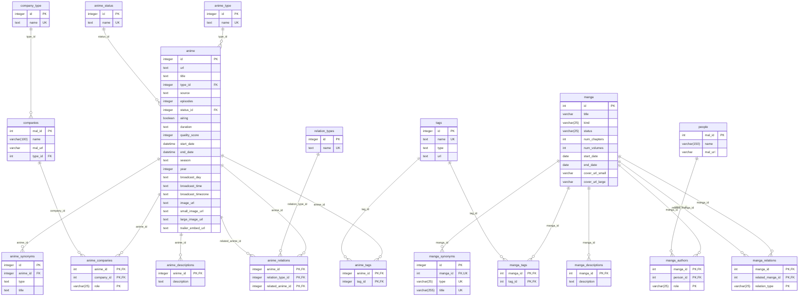

```mermaid
erDiagram
    anime_type {
        integer id PK
        text name UK
    }
    company_type {
        integer id PK
        text name UK
    }
    anime_status {
        integer id PK
        text name UK
    }
    relation_types {
        integer id PK
        text name UK
    }
    anime {
        integer id PK
        text url
        text title
        integer type_id FK
        text source
        integer episodes
        integer status_id FK
        boolean airing
        text duration
        integer quality_score
        datetime start_date
        datetime end_date
        text season
        integer year
        text broadcast_day
        text broadcast_time
        text broadcast_timezone
        text image_url
        text small_image_url
        text large_image_url
        text trailer_embed_url
    }
    anime_synonyms {
        integer id PK
        integer anime_id FK
        text type
        text title
    }
    anime_descriptions {
        integer anime_id PK,FK
        text description
    }
    companies {
        int mal_id PK
        varchar(100) name
        varchar mal_url
        int type_id FK
    }
    anime_companies {
        int anime_id PK,FK
        int company_id PK,FK
        varchar(25) role PK
    }
    tags {
        integer id PK
        text name UK
        text type
        text url
    }
    anime_tags {
        integer anime_id PK,FK
        integer tag_id PK,FK
    }
    anime_relations {
        integer anime_id PK,FK
        integer relation_type_id PK,FK
        integer related_anime_id PK,FK
    }
    manga {
        int id PK
        varchar title
        varchar(25) kind
        varchar(25) status
        int num_chapters
        int num_volumes
        date start_date
        date end_date
        varchar cover_url_small
        varchar cover_url_large
    }
    manga_synonyms {
        integer id PK
        int manga_id FK,UK
        varchar(25) type UK
        varchar(255) title UK
    }
    manga_descriptions {
        int manga_id PK,FK
        text description
    }
    manga_tags {
        int manga_id PK,FK
        int tag_id PK,FK
    }
    people {
        int mal_id PK
        varchar(150) name
        varchar mal_url
    }
    manga_authors {
        int manga_id PK,FK
        int person_id PK,FK
        varchar(25) role PK
    }
    manga_relations {
        int manga_id PK,FK
        int related_manga_id PK,FK
        varchar(25) relation_type PK
    }
    anime_type ||--o{ anime : "type_id"
    anime_status ||--o{ anime : "status_id"
    anime ||--o{ anime_synonyms : "anime_id"
    anime ||--o{ anime_descriptions : "anime_id"
    company_type ||--o{ companies : "type_id"
    anime ||--o{ anime_companies : "anime_id"
    companies ||--o{ anime_companies : "company_id"
    anime ||--o{ anime_tags : "anime_id"
    tags ||--o{ anime_tags : "tag_id"
    anime ||--o{ anime_relations : "anime_id"
    relation_types ||--o{ anime_relations : "relation_type_id"
    anime ||--o{ anime_relations : "related_anime_id"
    manga ||--o{ manga_synonyms : "manga_id"
    manga ||--o{ manga_descriptions : "manga_id"
    manga ||--o{ manga_tags : "manga_id"
    tags ||--o{ manga_tags : "tag_id"
    manga ||--o{ manga_authors : "manga_id"
    people ||--o{ manga_authors : "person_id"
    manga ||--o{ manga_relations : "manga_id"
    manga ||--o{ manga_relations : "related_manga_id"
```

Auto generated from https://sqltoerdiagram.com/